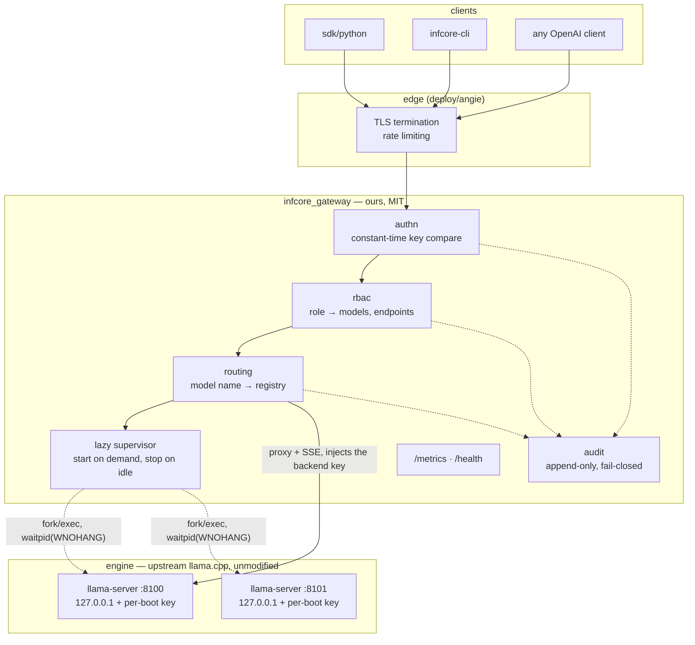
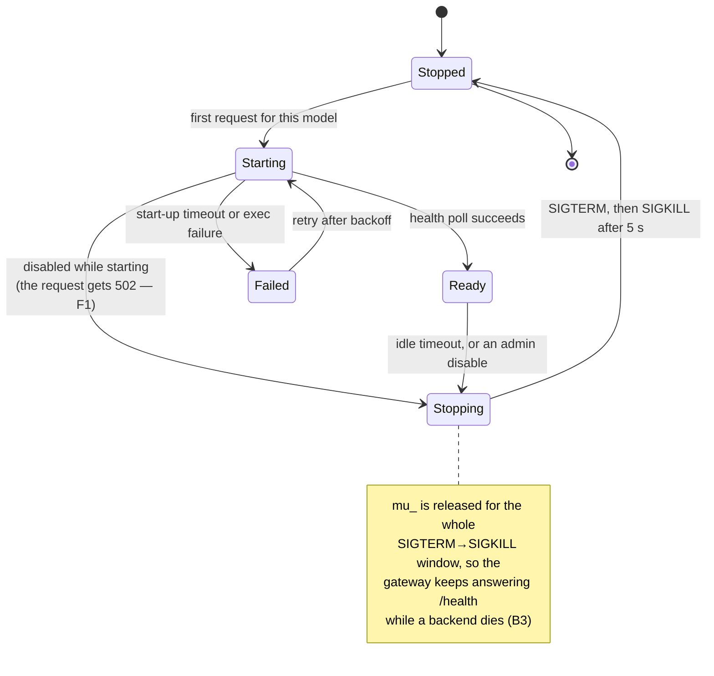
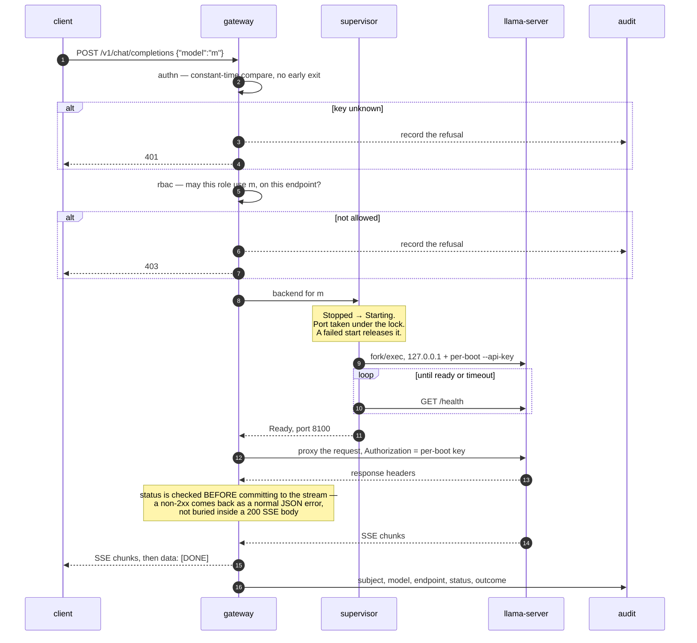

# infcore architecture

## Principle
A layer on top of llama.cpp, with no edits to the engine. The gateway/engine
runtime boundary is HTTP to separate `llama-server` processes; the engine's
C/C++ API stays inside upstream's `tools/server`. The engine (ggml + libllama +
tools/server) is upstream, and updates drop in. Everything "ours" lives under
`infcore/`.

## Layers
```
┌──────────────────────────────────────────────────────────────┐
│ infcore/sdk (client SDK) · infcore-cli                         │  clients
├──────────────────────────────────────────────────────────────┤
│ infcore/gateway: OpenAI-surface + routing + policy             │  API (ours)
│   authn/rbac (infcore/security) · audit · metrics (observ.)    │
│   registry (multi-model) · lazy-supervisor                     │
├──────────── runtime boundary: HTTP to loopback llama-server ───┤
│ tools/server (OpenAI-compat., SSE) · libllama (src/) · ggml    │  engine (upstream)
│   backends: cpu + cuda + vulkan; listens on 127.0.0.1 only     │
└──────────────────────────────────────────────────────────────┘
```

The same picture, with the trust boundaries drawn in — everything inside
`infcore/` is MIT code written here; everything below the runtime boundary is
upstream, unmodified, and reached only over loopback HTTP:



The gateway does not link `libllama`. Its only contact with the engine is
spawning a process and speaking HTTP to it on loopback — which is why an engine
update is a version bump rather than a merge.

## Process topology
- **Engine server:** `llama-server` (built from the engine tree, profile
  cpu+cuda+vulkan), serves the OpenAI-compatible API. Managed backends always
  listen on 127.0.0.1 only and start with a per-boot random `--api-key`; a
  direct hit on their ports (8100+) without the key -> 401.
- **Gateway (`infcore_gateway`):** our layer on top — the single entry point:
  authn/RBAC, routing via the multi-model registry, audit, pull-based metrics,
  healthcheck. Acts as a proxy-front in front of the `llama-server`
  subprocesses; when proxying, it attaches the backend's per-boot key to
  `Authorization`.

## Lazy supervisor
Managed models (no `backend_url`) are brought up on the first request and shut
down on idle. Port assignment happens under a lock (no race); on a failed
start, backoff and the port is released; liveness is tracked via
`waitpid(WNOHANG)` (no zombies, dead backends are detected); the active-token
is RAII (a client abort does not leak into the counter).

The states are `Stopped · Starting · Ready · Failed · Stopping`
(`runtime/backend_supervisor.h`). The two edges worth knowing about are the ones
that used to be bugs:



`F1` and `B3` are the checks in `tests/manual/hardening_smoke.sh` that hold these
two properties in place; they run in CI.

## Request flow (chat, OpenAI)
1. REST accepts `/v1/chat/completions` → `authn` (api_key, constant-time
   comparison).
2. `rbac`: role → is the model/endpoint allowed (allow_endpoints).
3. `routing`: `model` → `registry` → backend (the `llama-server` for the
   requested model, brought up by the supervisor if needed).
4. Proxying, with SSE when `stream:true`. The upstream status is checked
   BEFORE committing to the stream: a non-2xx is returned as a plain JSON
   error (OpenAI shape), not as SSE inside a 200; synthetic errors terminate
   the stream with `data: [DONE]`.
5. `audit` (who/model/endpoint/status/outcome, including rejections) +
   `metrics`.

The cold path — a first request for a model that is not running yet — with the
two places the request can be rejected before anything is spawned:



Every branch that ends the request early still writes an audit record. With
`audit.require=true`, a failure to write that record turns the request into a
`503` rather than a served answer — checked by `F2` in the hardening smoke.

## Offline invariants
- No outbound connections at runtime (`offline.enforce_no_egress`,
  `tests/egress/`).
- Local GGUF only. Important: the llama.cpp engine (upstream) **contains**
  network-fetch code (`common/download.cpp`, `-hf`/`--model-url`, fetching
  remote images in `server-common.cpp`). Per the wrap-not-touch rule we do not
  edit the engine, so this code is **not removed, but neutralized**: the
  supervisor never passes download-triggering arguments, and egress is blocked
  at the infrastructure level (systemd `IPAddressDeny`, docker
  `internal: true`) plus the `enforce_no_egress` check for external
  `backend_url` values (loopback/RFC1918 only).
- Dependencies come from internal mirrors.

## Models and modalities
Any local GGUF is supported, same as llama.cpp: text, embeddings, rerank
(`--reranking`), vision (VLM via `mmproj_path` -> `--mmproj`). Audio (ASR/TTS)
is out of scope for this project. New architectures arrive drop-in along with
engine updates.
